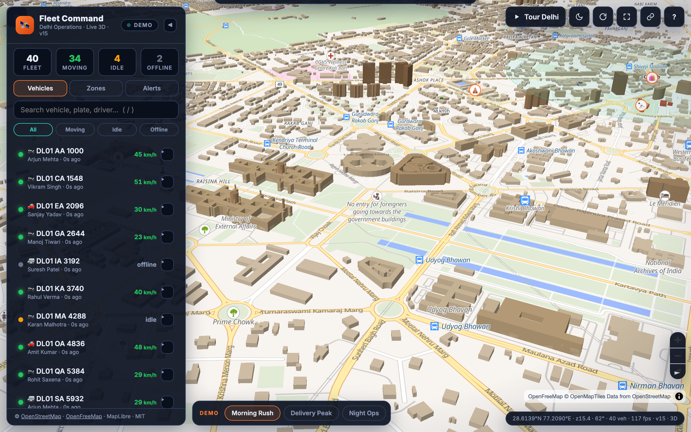

# Delhi Fleet Map

A self-contained 3D fleet tracking dashboard for Delhi operations. No backend required — runs entirely in the browser.

**Live demo → [saisreenivas.github.io/delhi-fleet-map](https://saisreenivas.github.io/delhi-fleet-map/)**




## Features

- 3D MapLibre GL map centered on Delhi with globe intro
- 40-vehicle demo simulation (rush / delivery / night scenarios)
- Live mode — point `FLEET_CONFIG.api.vehiclesUrl` at any JSON vehicles endpoint
- Day / dusk theme toggle (`D` key or button)
- Vehicle list, zone explorer, and activity feed panels
- Auto-orbit showcase after inactivity

## Live Mode Setup

Edit `FLEET_CONFIG` near the top of `index.html`:

```js
api: {
  vehiclesUrl: 'https://your-api.example.com/v1/vehicles',
  headers: { Authorization: 'Bearer YOUR_TOKEN' },
  pollMs: 5000,
  transform: (raw) => raw,   // adapt any response shape here
},
```

Expected vehicle shape:

```json
{
  "id": "v1",
  "name": "Truck 01",
  "lat": 28.6139,
  "lng": 77.2090,
  "heading": 45,
  "speed": 32,
  "status": "moving",
  "type": "truck",
  "driver": "Ravi Kumar"
}
```

`status` — `moving` | `idle` | `offline`  
`type` — `truck` | `van` | `bike` | `car`

## Customisation

All config lives in `window.FLEET_CONFIG` at the top of `index.html`:

| Key | Default | Description |
|-----|---------|-------------|
| `company.name` | `Fleet Command` | Header title |
| `company.accent` | `#ff7a2f` | Brand colour |
| `map.theme` | `day` | `day` \| `dusk` |
| `map.center` | Delhi | `[lng, lat]` |
| `demo.vehicleCount` | `40` | Simulated vehicles |
| `demo.scenario` | `rush` | `rush` \| `delivery` \| `night` |

## Keyboard Shortcuts

| Key | Action |
|-----|--------|
| `D` | Toggle day / dusk theme |
| `R` | Reset camera to Delhi |
| `Space` | Play / pause demo |
